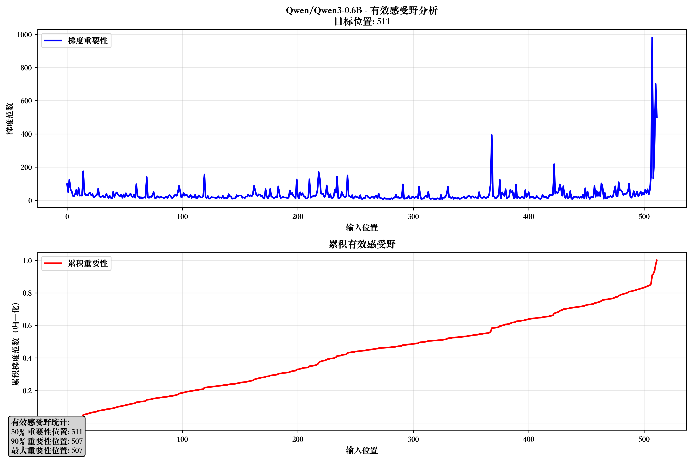
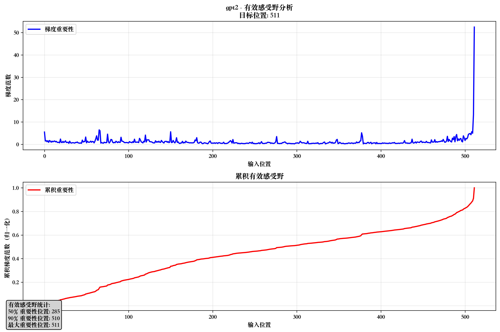
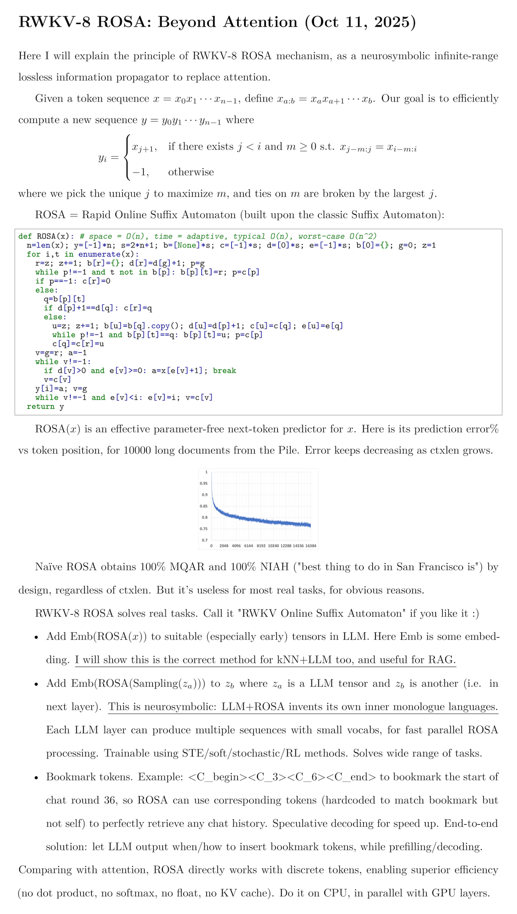

# llm_with_text_compression

LLM with Text Compression

## H-Net Lite

Replacing Mamba block with MLA and MoE MLP-FFN, H-Net may perform better.

## Proto-Token Lite

A minimum implementation for [Proto-Token](https://arxiv.org/abs/2505.21189v1). Could be further expanded and optimized.

Below is the output:

```plain text
Iteration 9900, Loss: 1.3614133596420288
Reconstruction accuracy: 85.19%
Predicted text: This is an example text we we want to reconstruct using proto-tokens. It should long enough enough to test the..
```

## LLM Gradient Plot (ERF, Experimental)

The gradient distribution of `Qwen/Qwen3-0.6B`:



The gradient distribution of `gpt2`:



WARNINGS: The implementation may have issues & bugs. Welcome to report.

## Text Compression Using LSTM

Awaiting for enhancement.

## Rapid Online Suffix Automation Mechanism

A novel attention alternative mechanism.



## Future Work

1. Exploring a better token chunking method to compress the context and in the meanwhile achieves semantic coherency.
2. Propose a text compression method that can enhance the LLM throughput.
